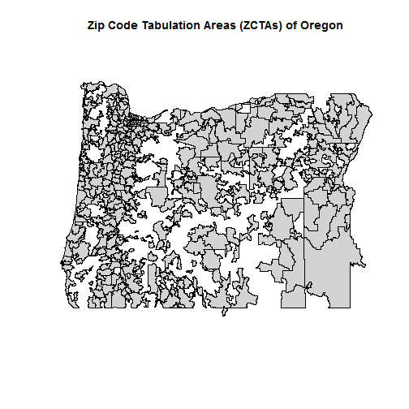
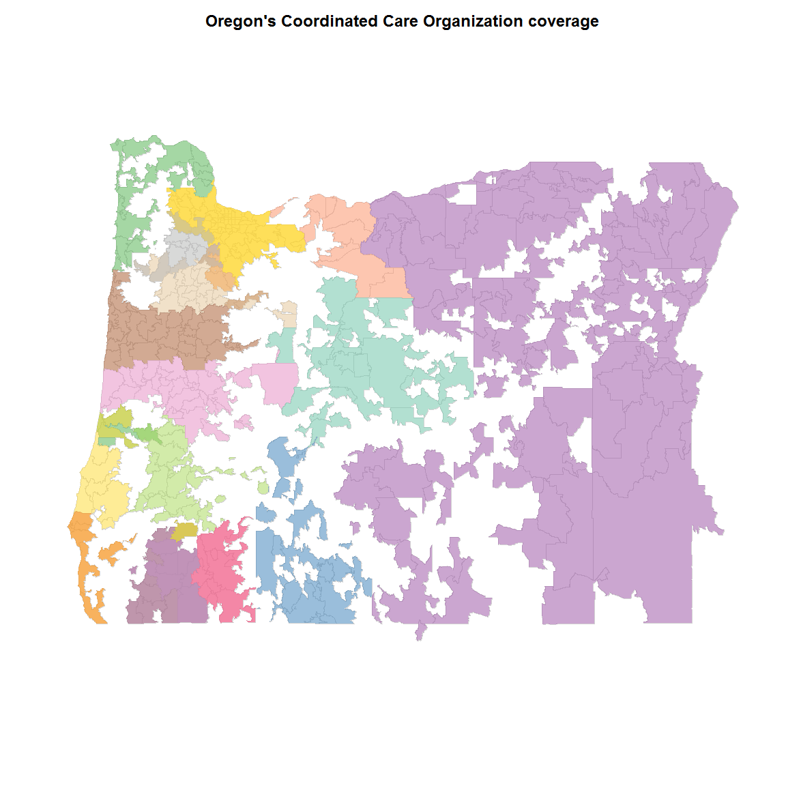

Mapping Oregon Coordinated Care Organizations (CCO)
===================================================

Background
----------

Download TIGER 2012 shapefiles [here](http://www.census.gov/geo/maps-data/data/tiger-line.html). Store the shapefiles on the CHSE server in the "`DataRepository/Shapefiles/TIGER 2012`" folder. The shapefiles will be read by the `readShapeLines` and `readShapePoly` functions from the `maptools` package.

Zip Code Tabulation Areas (ZCTAs) will be mapped and color coded by CCO.

Resources:
* [Combining Spatial Data](http://cran.r-project.org/web/packages/maptools/vignettes/combine_maptools.pdf)
* [Maps in R -- Examples](http://geography.uoregon.edu/geogr/topics/maps.htm)
* [adding variable to shapefile](http://r-sig-geo.2731867.n2.nabble.com/adding-variable-to-shapefile-td6193408.html)

Load `maptools`

```r
require(maptools, quietly = TRUE)
```

```
## Checking rgeos availability: TRUE
```

```r
require(RColorBrewer, quietly = TRUE)
```


Mapping
-------

Read in the TIGER 2012 shapefiles:
* Zip Code Tabulation Area (ZCTA) shapefile
* County shapefile

I'm not sure how the `proj4string` parameter works, but it fixes the projection.

```r
# ZCTA shapefile
dir <- "E:/DataRepository/Shapefiles/TIGER 2012/tl_2012_us_zcta510"
file <- paste(dir, "tl_2012_us_zcta510.shp", sep = "/")
shpZCTALines <- readShapeLines(file, proj4string = CRS("+proj=longlat"))
shpZCTAPoly <- readShapePoly(file, proj4string = CRS("+proj=longlat"))
# County shapefile
dir <- "E:/DataRepository/Shapefiles/TIGER 2012/tl_2012_us_county"
file <- paste(dir, "tl_2012_us_county.shp", sep = "/")
shpCountyLines <- readShapeLines(file, proj4string = CRS("+proj=longlat"))
# shpCountyPoly <- readShapePoly(file, proj4string=CRS('+proj=longlat'))
```


Keep only counties in Oregon (`STATE == 41`). Oregon ZCTAs will be extracted following this.

```r
shpCountyLines <- subset(shpCountyLines, STATEFP == 41)
summary(shpCountyLines)
```

```
## Object of class SpatialLinesDataFrame
## Coordinates:
##       min    max
## x -124.70 -116.5
## y   41.99   46.3
## Is projected: FALSE 
## proj4string : [+proj=longlat]
## Data attributes:
##     STATEFP      COUNTYFP      COUNTYNS      GEOID           NAME   
##  41     :36   001    : 1   01135845: 1   41001  : 1   Baker    : 1  
##  01     : 0   003    : 1   01135846: 1   41003  : 1   Benton   : 1  
##  02     : 0   005    : 1   01135847: 1   41005  : 1   Clackamas: 1  
##  04     : 0   007    : 1   01135848: 1   41007  : 1   Clatsop  : 1  
##  05     : 0   009    : 1   01135849: 1   41009  : 1   Columbia : 1  
##  06     : 0   011    : 1   01135850: 1   41011  : 1   Coos     : 1  
##  (Other): 0   (Other):30   (Other) :30   (Other):30   (Other)  :30  
##              NAMELSAD       LSAD    CLASSFP   MTFCC        CSAFP   
##  Baker County    : 1   06     :36   C7: 0   G4020:36   102    : 2  
##  Benton County   : 1   00     : 0   H1:36              140    : 2  
##  Clackamas County: 1   03     : 0   H4: 0              104    : 0  
##  Clatsop County  : 1   04     : 0   H5: 0              112    : 0  
##  Columbia County : 1   05     : 0   H6: 0              118    : 0  
##  Coos County     : 1   07     : 0                      (Other): 0  
##  (Other)         :30   (Other): 0                      NA's   :32  
##      CBSAFP      METDIVFP  FUNCSTAT     ALAND              AWATER        
##  38900  : 5   13644  : 0   A:36     Min.   :1.12e+09   Min.   :1.24e+06  
##  37820  : 2   14484  : 0   B: 0     1st Qu.:2.44e+09   1st Qu.:1.81e+07  
##  41420  : 2   15764  : 0   C: 0     Median :4.73e+09   Median :4.52e+07  
##  10540  : 1   15804  : 0   F: 0     Mean   :6.91e+09   Mean   :1.72e+08  
##  11820  : 1   16974  : 0   G: 0     3rd Qu.:8.00e+09   3rd Qu.:2.44e+08  
##  (Other):14   (Other): 0   N: 0     Max.   :2.62e+10   Max.   :9.35e+08  
##  NA's   :11   NA's   :36   S: 0                                          
##         INTPTLAT          INTPTLON 
##  +42.3853736: 1   -117.1855796: 1  
##  +42.4117820: 1   -117.6039637: 1  
##  +42.4666711: 1   -117.6919334: 1  
##  +42.6837613: 1   -117.9991356: 1  
##  +42.7884009: 1   -118.7338795: 1  
##  +43.0643552: 1   -118.9859493: 1  
##  (Other)    :30   (Other)     :30
```

Plot the Oregon counties.

```r
plot(shpCountyLines)
title(main = "Counties of Oregon")
```

 


Since ZCTAs do not exactly correspond to geographical units, we need to read in the TIGER 2012 ZCTA relationship file that links ZCTAs to states and counties. 

```r
dir <- "E:/DataRepository/Shapefiles/TIGER 2012/ZCTA Relationship Files"
file <- paste(dir, "zcta_county_rel_10.txt", sep = "/")
zctarel <- read.table(file, header = TRUE, sep = ",")
head(zctarel)
```

```
##   ZCTA5 STATE COUNTY GEOID POPPT  HUPT    AREAPT AREALANDPT  ZPOP   ZHU
## 1   601    72      1 72001 18465  7695 165132671  164333375 18570  7744
## 2   601    72    141 72141   105    49   2326414    2326414 18570  7744
## 3   602    72      3 72003 41520 18073  83734431   79288158 41520 18073
## 4   603    72      5 72005 54689 25653  82063867   81880442 54689 25653
## 5   606    72     93 72093  6276  2740  94864349   94851862  6615  2877
## 6   606    72    121 72121    89    38   6679806    6679806  6615  2877
##       ZAREA ZAREALAND COPOP  COHU    COAREA COAREALAND ZPOPPCT ZHUPCT
## 1 167459085 166659789 19483  8125 173777444  172725651   99.43  99.37
## 2 167459085 166659789 33149 14192 298027589  294039825    0.57   0.63
## 3  83734431  79288158 41959 18258 117948080   79904246  100.00 100.00
## 4  82063867  81880442 60949 28430 195741178   94608641  100.00 100.00
## 5 109592548 109580061  6276  2740  94864349   94851862   94.88  95.24
## 6 109592548 109580061 25265 10958  92831653   92806330    1.35   1.32
##   ZAREAPCT ZAREALANDPCT COPOPPCT COHUPCT COAREAPCT COAREALANDPCT
## 1    98.61        98.60    94.77   94.71     95.03         95.14
## 2     1.39         1.40     0.32    0.35      0.78          0.79
## 3   100.00       100.00    98.95   98.99     70.99         99.23
## 4   100.00       100.00    89.73   90.23     41.92         86.55
## 5    86.56        86.56   100.00  100.00    100.00        100.00
## 6     6.10         6.10     0.35    0.35      7.20          7.20
```


Create a character vector of ZCTAs and add it to the ZCTA relationship data frame. Then subset the ZCTA relationship file for Oregon (`STATE == 41` and ZCTA beginning with "97").

```r
ZCTA5CHR <- sprintf("%05d", zctarel$ZCTA5)
zctarel <- data.frame(ZCTA5CHR, zctarel)
zctarel <- zctarel[zctarel$STATE == 41 & grepl("^97", zctarel$ZCTA5CHR), ]
head(zctarel)
```

```
##       ZCTA5CHR ZCTA5 STATE COUNTY GEOID POPPT  HUPT    AREAPT AREALANDPT
## 42959    97001 97001    41     65 41065   229    76 770979271  770309402
## 42960    97002 97002    41      5 41005  1334   516  33771413   32912466
## 42961    97002 97002    41     47 41047  4289  1714  78470445   77842217
## 42962    97004 97004    41      5 41005  4388  1689 113470761  113398767
## 42963    97005 97005    41     67 41067 24906 10955  13753498   13753498
## 42964    97006 97006    41     67 41067 63036 25287  30429045   30429045
##        ZPOP   ZHU     ZAREA ZAREALAND  COPOP   COHU    COAREA COAREALAND
## 42959   229    76 770979271 770309402  25213  11487 6.204e+09  6.168e+09
## 42960  5623  2230 112241858 110754683 375992 156945 4.876e+09  4.844e+09
## 42961  5623  2230 112241858 110754683 315335 120948 3.089e+09  3.062e+09
## 42962  4388  1689 113470761 113398767 375992 156945 4.876e+09  4.844e+09
## 42963 24906 10955  13753498  13753498 529710 212450 1.881e+09  1.876e+09
## 42964 63036 25287  30429045  30429045 529710 212450 1.881e+09  1.876e+09
##       ZPOPPCT ZHUPCT ZAREAPCT ZAREALANDPCT COPOPPCT COHUPCT COAREAPCT
## 42959  100.00 100.00   100.00       100.00     0.91    0.66     12.43
## 42960   23.72  23.14    30.09        29.72     0.35    0.33      0.69
## 42961   76.28  76.86    69.91        70.28     1.36    1.42      2.54
## 42962  100.00 100.00   100.00       100.00     1.17    1.08      2.33
## 42963  100.00 100.00   100.00       100.00     4.70    5.16      0.73
## 42964  100.00 100.00   100.00       100.00    11.90   11.90      1.62
##       COAREALANDPCT
## 42959         12.49
## 42960          0.68
## 42961          2.54
## 42962          2.34
## 42963          0.73
## 42964          1.62
```


Subset the TIGER shapefile to include only the Oregon ZCTAs.

```r
ZCTAOR <- zctarel$ZCTA5[!duplicated(zctarel$ZCTA5)]
shpZCTALines <- subset(shpZCTALines, ZCTA5CE10 %in% ZCTAOR)
summary(shpZCTALines)
```

```
## Object of class SpatialLinesDataFrame
## Coordinates:
##       min     max
## x -124.57 -116.46
## y   41.85   46.24
## Is projected: FALSE 
## proj4string : [+proj=longlat]
## Data attributes:
##    ZCTA5CE10      GEOID10    CLASSFP10  MTFCC10    FUNCSTAT10
##  97001  :  1   97001  :  1   B5:417    G6350:417   S:417     
##  97002  :  1   97002  :  1                                   
##  97004  :  1   97004  :  1                                   
##  97005  :  1   97005  :  1                                   
##  97006  :  1   97006  :  1                                   
##  97007  :  1   97007  :  1                                   
##  (Other):411   (Other):411                                   
##     ALAND10            AWATER10              INTPTLAT10 
##  Min.   :1.88e+04   Min.   :0.00e+00   +41.9299921:  1  
##  1st Qu.:6.10e+07   1st Qu.:5.41e+04   +42.0341396:  1  
##  Median :1.80e+08   Median :5.58e+05   +42.0364865:  1  
##  Mean   :3.93e+08   Mean   :5.31e+06   +42.0843863:  1  
##  3rd Qu.:4.21e+08   3rd Qu.:3.56e+06   +42.1189763:  1  
##  Max.   :1.34e+10   Max.   :1.98e+08   +42.1230944:  1  
##                                        (Other)    :411  
##         INTPTLON10 
##  -116.7369842:  1  
##  -116.9184440:  1  
##  -117.0395862:  1  
##  -117.0841615:  1  
##  -117.1072752:  1  
##  -117.1612358:  1  
##  (Other)     :411
```

```r
shpZCTAPoly <- subset(shpZCTAPoly, ZCTA5CE10 %in% ZCTAOR)
summary(shpZCTAPoly)
```

```
## Object of class SpatialPolygonsDataFrame
## Coordinates:
##       min     max
## x -124.57 -116.46
## y   41.85   46.24
## Is projected: FALSE 
## proj4string : [+proj=longlat]
## Data attributes:
##    ZCTA5CE10      GEOID10    CLASSFP10  MTFCC10    FUNCSTAT10
##  97001  :  1   97001  :  1   B5:417    G6350:417   S:417     
##  97002  :  1   97002  :  1                                   
##  97004  :  1   97004  :  1                                   
##  97005  :  1   97005  :  1                                   
##  97006  :  1   97006  :  1                                   
##  97007  :  1   97007  :  1                                   
##  (Other):411   (Other):411                                   
##     ALAND10            AWATER10              INTPTLAT10 
##  Min.   :1.88e+04   Min.   :0.00e+00   +41.9299921:  1  
##  1st Qu.:6.10e+07   1st Qu.:5.41e+04   +42.0341396:  1  
##  Median :1.80e+08   Median :5.58e+05   +42.0364865:  1  
##  Mean   :3.93e+08   Mean   :5.31e+06   +42.0843863:  1  
##  3rd Qu.:4.21e+08   3rd Qu.:3.56e+06   +42.1189763:  1  
##  Max.   :1.34e+10   Max.   :1.98e+08   +42.1230944:  1  
##                                        (Other)    :411  
##         INTPTLON10 
##  -116.7369842:  1  
##  -116.9184440:  1  
##  -117.0395862:  1  
##  -117.0841615:  1  
##  -117.1072752:  1  
##  -117.1612358:  1  
##  (Other)     :411
```

Plot the Oregon ZCTAs. These are all the ZCTAs in Oregon that are on the TIGER 2012 shapefile. Note, there's an anomaly in southern Oregon, a ZCTA juts into California. Also, note that the entire state is not filled in; i.e., there are areas of the state that do not have a corresponding ZCTA. These "empty" areas are unpopulated areas. *For the 2010 Census, large water bodies and large unpopulated land areas do not have ZCTAs.* ([ref: census.gov](http://www.census.gov/geo/reference/zctas.html))

```r
plot(shpZCTAPoly, col = "lightgrey")
title(main = "Zip Code Tabulation Areas (ZCTAs) of Oregon")
```

 


Merge the attributes from the ZCTA relationship file to the Oregon shapefile. Some ZCTAs span across counties. So we'll exclude the attributes that are county-specific; e.g., 2010 Population of the 2010 County (`COPOP`) and Total Area of the 2010 County (`COAREA`). The record file layout can be found [here](http://www.census.gov/geo/maps-data/data/zcta_rel_layout.html).
**This code chunk seems to break things --- DO NOT EVALUATE**

```r
d1 <- shpZCTAPoly@data
d2 <- subset(zctarel, !duplicated(ZCTA5), select = c(ZCTA5CHR, ZCTA5, STATE, 
    ZPOP, ZHU, ZAREA, ZAREALAND))
d <- merge(d1, d2, by.x = "ZCTA5CE10", by.y = "ZCTA5")
shpZCTAPoly@data <- d
summary(shpZCTAPoly)
```


Read in the CCO zip code data compiled by Peter Graven. The file we'll use is `Zip CCO_edit.csv`. **Need to check with Peter if this is the correct one to use.**

```r
dir <- "//ohsum01.ohsu.edu/OHSU/OHSU Shared/Restricted/OCHSER/PROJECTS/EX13-04_Oregon_CO&CCOs/CCO Maps/Data"
file <- "Zip CCO_edit.csv"
lookupCCO <- read.csv(paste(dir, file, sep = "/"))
lookupCCO <- lookupCCO[order(lookupCCO$CCO, lookupCCO$Zip_Code), ]
lookupCCO <- lookupCCO[grepl("^97", sprintf("%05d", lookupCCO$Zip_Code)), ]
head(lookupCCO)
```

```
##    Zip_Code     CCO
## 1     97406 AllCare
## 9     97410 AllCare
## 2     97415 AllCare
## 10    97442 AllCare
## 3     97444 AllCare
## 4     97450 AllCare
```


Fix some screwed up values.

```r
lookupCCO$CCO[lookupCCO$CCO == "Health Share of Oregon"] <- "HealthShare of Oregon"
lookupCCO$CCO[lookupCCO$CCO == "Intercommunity"] <- "Intercommunity Health Network"
lookupCCO$CCO[lookupCCO$CCO == "Primary Health of Josephine County"] <- "PrimaryHealth of Josephine County"
lookupCCO$CCO <- factor(lookupCCO$CCO)
```


Get the number of CCOs and create a [Color Brewer](http://colorbrewer2.org/) palette. Since the number of CCOs exceeds the maximum number of values possible in a palette, we'll create 2 separate palettes (Set1, Set2) and concatenate them.

```r
nCCO <- length(table(lookupCCO$CCO))
n <- ceiling(nCCO/2)
pal1 <- brewer.pal(n, "Set1")
pal2 <- brewer.pal(n, "Set2")
pal <- c(pal1, pal2)
```


Add 50% transparency to the palette.

```r
pal <- paste(pal, as.hexmode(floor(255 * 0.5)), sep = "")
```


Next, assign each CCO to a palette value.

```r
CCO <- names(table(lookupCCO$CCO))
pal <- data.frame(CCO, pal)
head(pal)
```

```
##                       CCO       pal
## 1                 AllCare #E41A1C7f
## 2 Cascade Health Alliance #377EB87f
## 3        Columbia Pacific #4DAF4A7f
## 4          Eastern Oregon #984EA37f
## 5              FamilyCare #FF7F007f
## 6   HealthShare of Oregon #FFFF337f
```


Define function to plot each CCO as a layer.

```r
layer <- function(x) {
    l <- lookupCCO[lookupCCO$CCO == x, "Zip_Code"]
    c <- as.character(pal[pal$CCO == x, "pal"])
    shpx <- subset(shpZCTAPoly, ZCTA5CE10 %in% l)
    plot(shpx, add = TRUE, col = c, border = NA)
}
```


Run the layering function, iterating through all the CCOs. The function isn't smart enough to deal with ZCTAs that have multiple CCOs assigned. With the transparency added to the palette values, overlapping CCOs will have their colors overlap as well. This will create some odd colors. Also, not all ZCTAs are mapped to a CCO

```r
plot(shpZCTAPoly, border = "lightgrey")
title(main = "Oregon's Coordinated Care Organization coverage", cex.main = 2)
for (i in 1:nCCO) {
    layer(CCO[i])
}
```

 

